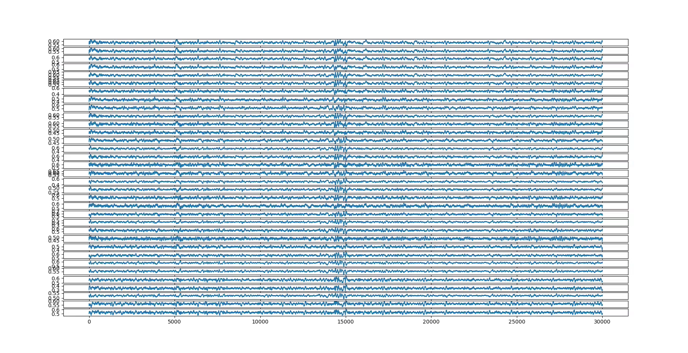
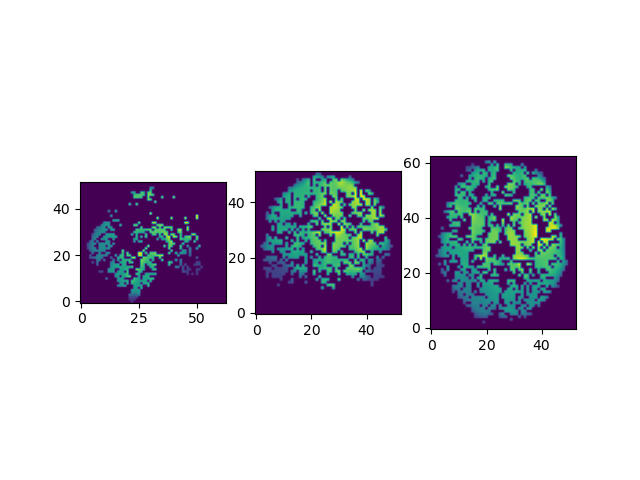
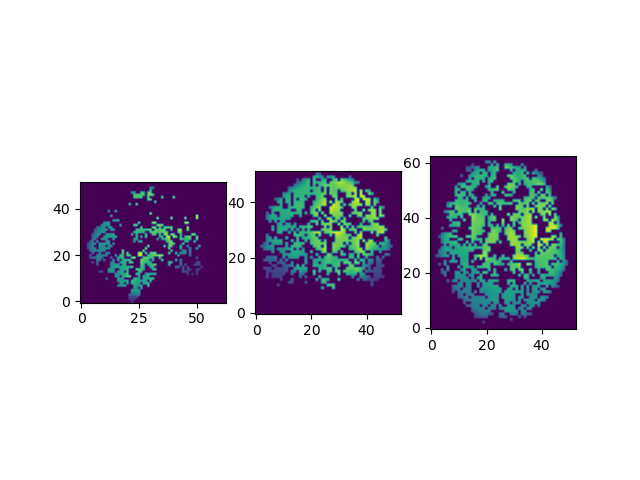
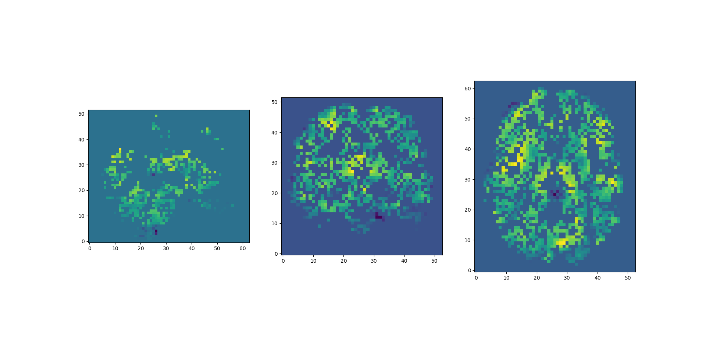
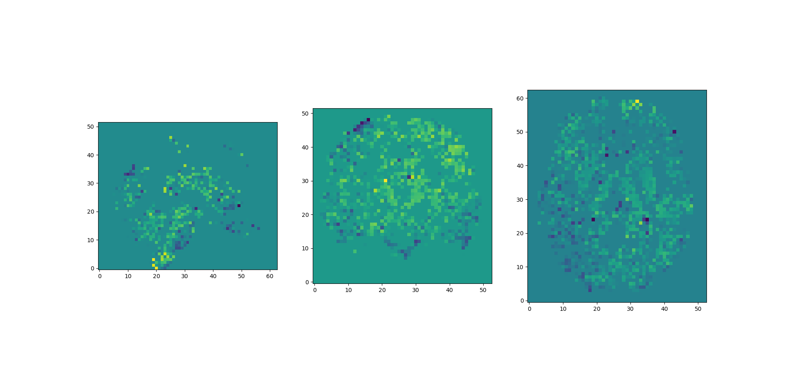

# EEG2fMRI
Paul Bricman, Jelmer Borst

## Problem Statement
Current techniques for recording neural activity are limited. EEG (based on electrodes placed on the subject's scalp) is a neuroimaging technique with high temporal resolution (sampling frequency), yet poor spatial resolution (due to the signal being obstructed and filtered by the brain and the skull). In contrast, fMRI is a technique with high spatial resolution (due to its reliance on electromagnetic waves which penetrate the brain), yet poor temporal resolution. There is no one-size-fits-all neuroimaging technique and neuroscients often have to make compromises based on their object of study.

## Suggested Solution

Neural activity is the target of recording for both EEG and fMRI. Therefore, it's possible that the EEG signal could be used to somehow "triangulate" neural activity at the precise locations captured by fMRI, at least in brain regions located near the scalp. Essentially, a machine learning model could be used to approximately reconstruct fMRI samples based on EEG samples. Multi-modal neuroimaging studies provide a unique opportunity for exploring this mapping. Those studies are based on simultaneous recordings with both EEG and fMRI, providing a perfectly aligned cross-modal signal which a machine learning model could use for training. A model capable of supporting this mapping would greatly augment the spatial resolution which can be achieved with EEG. 

## Implementation

We used a dataset from a multi-modal neuroimaging study which involved visual and auditory oddball tasks.[^1] The reason we chose this dataset, among other multi-modal neuroimaging ones, was that visual and auditory areas might be easier for the model to distinguish compared to more distributed networks of regions. Based on this dataset, we derived individual samples with the following structure. The input part of a data point consists of a 30-second-long EEG recording across 34 electrodes at 1000Hz. This data resembles 34 parallel time series unfolding across 30 seconds. Each time series comes from a certain electrode placed in a certain place on the subject's scalp.

The output part of a data point consists of a three-dimensional tensor of shape 53x63x52 which depicts the 3D "picture" of the subject's brain obtained through fMRI at the time roughly corresponding to the end of the EEG recording.

For the input part of a data point, the recording length of 30 seconds has been chosen for the following reason. fMRI doesn't record neural activity per se, but blood oxygen levels, the BOLD response, which is a reasonable proxy for neural activity. However, the BOLD response isn't an immediate one-to-one reflection of neural activity, but the result of a convolution between neural activity and a response curve informed by the brain's physiology (the BOLD response curve). This is conceptually similar to how "eating" activity isn't instantly reflected in blood sugar levels, but reflects the result of a convolution informed by metabolism. In the case of fMRI, recordings at any given time are influenced by neural activity which occured roughly during the previous 30 seconds. That's why 30 seconds of EEG are paired with one fMRI scan obtained at the end of the EEG recording, forming a data point. In contrast, EEG data itself closely reflects neural activity unfolding at that exact time of recording (albeit with very poor spatial resolution).

The raw original dataset is structured as follows. There are 16 subjects (after excluding one whose data was corrupted), each undergoing 6 blocks of an oddball task. Each block contains 170 fMRI scans, obtained sequentially, at a frequency of 0.5 Hz (for a total of about ~340 seconds per block). Each block also contains EEG data, recorded constantly at 1000Hz for the entire duration of the block. From these longer sequences of data, we're extracting data points in the way described previously. However, we're discarding the first few fMRI scans obtained before 30 seconds of EEG managed to accumulate beforehand. This means that ~155 samples are derived per block, which translates to 930 per subject, which translates to 14880 in total.

In terms of preprocessing, EEG data was normalized per subject AND per channel. The reasoning behind this was to remove influences of electrodes being placed in slightly different locations across subjects. The preprocessing pipeline for fMRI is more complex, consisting of: motion correction, slice time correction, registration, normalization, and smoothing. Additionally each tensor obtained through a fMRI scan has been "masked" in order to only contain non-zero values at locations which are known to contain white and gray matter. All these preprocessing stages where used to increase the signal-to-noise ration in both EEG and fMRI, limiting the influence of subject-specific particularities on the data so that the mapping would be performed as effectively as possible.

## Models

Initially, we trained fully-connected models to perform the mapping between the short EEG recording and the analogous fMRI scan. A component of this model was designed to derive embeddings from individual EEG channels, meaning that the same component could be trained and used to derive embeddings for each separate channel. Afterwards, all channels would be concatenated and fed through a common fully-connected network whose number of output neurons corresponded to the number of voxels in the fMRI scan.

We also trained models whose channel embedding components were based on convolutional layers spanning the time axis, rather than fully-connected ones. Additionally, we experimented with transformers after framing the EEG-fMRI problem as a sequence-to-sequence transduction task from EEG channels to fMRI slices.

We also tried tweaking activation functions, loss functions, optimizers, learning rates, batch size, layer sizes, learning rate schedules, and other hyperparameters in the process.

## Results & Obstacles

In the case in which data from all subjects is shuffled randomly into training and testing data, testing performance eventually becomes very good.

### Target

### Prediction

However, if the testing data is configured to only contain data from a subject which has not been part of the training phase at all, then testing performance doesn't reach a useful level. In the one-subject-left-out setup, the model fails to generalize to the unseen subject. To tackle this, we tried: dropout, weight decay, batch normalization, and reducing model complexity. Still, generalization to an unseen subject remains challenging.

### Target

### Prediction

## References

[^1]: https://legacy.openfmri.org/dataset/ds000116/